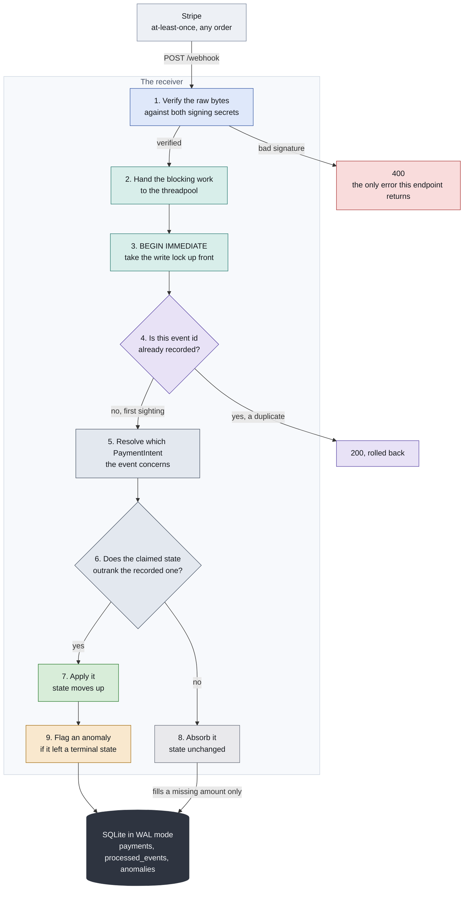

# stripe-reconciler

[](https://github.com/Michael-QA-Labs/stripe-reconciler/actions/workflows/ci.yml)
[](https://michael-qa-labs.github.io/stripe-reconciler/)

A Stripe webhook receiver that implements its own event sequencing and
idempotency logic, plus the test suite that proves the logic works.

## Why this problem is hard

Stripe guarantees at-least-once delivery. It does not guarantee ordered
delivery. In practice that means three things happen to every production
webhook endpoint, and all three look like the same symptom (a payment stuck in
the wrong state) from the outside:

1. **The same event arrives more than once.** A retry after a timeout, or a
   redelivery, hands you an event id you have already processed. Processing it
   twice double-counts a capture or a refund.
2. **Events arrive out of order.** `payment_intent.succeeded` can land before
   the `payment_intent.processing` that preceded it. Handling each event as it
   comes, without asking whether it is stale, lets a payment regress from a
   settled state back to an in-flight one.
3. **Events arrive late.** An event delayed past a retry window can show up
   after the payment has already reached a terminal state, and must be absorbed
   rather than applied.

None of that is solved by Stripe's SDK. Signature verification proves an event
is authentic; it says nothing about whether the event is current. The
sequencing rule, the dedupe, and the idempotency store are the receiver's own
responsibility, which makes them the receiver's own bugs. This project writes
that logic explicitly, as a transition table where terminal states absorb and
state never regresses, and then tests it against duplicate, reordered, and late
delivery rather than asserting it works.

## Watch it work


A real browser drives a real test card through Stripe's own hosted Checkout
page. The payment succeeds, and the webhook that records it arrives separately,
a moment later. That gap is the whole subject of this repo.

This is the [Playwright suite](tests/browser/test_checkout.py) running headed,
not a mockup. The assertion it makes is deliberately cross protocol: the browser
causes the payment, and the check happens over HTTP against our own receiver
after Stripe delivers the event. Asserting on Stripe's success page would prove
only that Stripe works.

## How a delivery is handled

Every webhook delivery walks the same nine steps. Nothing buffers, nothing
sleeps waiting for a predecessor, and nothing consults a clock to decide an
outcome.



Colour groups the steps by what they do rather than decorating them: the signature gate in blue, the concurrency machinery in teal, deduplication in violet, the resolve and rank decision in slate, and the three outcomes in green, grey and amber. Red is the one path that returns an error.

**1. Verify the raw bytes.** The body must be the exact bytes Stripe sent, so
the handler reads `request.body()` rather than a parsed model. A re-serialized
payload is a different byte string and fails verification. Two signing secrets
exist and they are not interchangeable, the CLI one for `stripe listen` locally
and the dashboard one for the deployed endpoint, so each is tried in turn. That
is what lets the same code serve both without an environment switch.

**2. Hand the blocking work to the threadpool.** This step looks like plumbing
and is not. The endpoint was originally an `async def` calling synchronous
SQLite work directly, which ran it on the event loop and serialized every
delivery. Firing eight at once measured **one request in flight out of eight**.
That is head of line blocking: one slow write delays everything including
`/health`, and Stripe retries responses it considers slow. Those retries are
duplicate deliveries, so the receiver would have been manufacturing the exact
failure it exists to absorb. After the fix, eight of eight.

**3. Take the write lock up front.** `BEGIN IMMEDIATE` claims the lock now
rather than on first write, so reading the current state and writing the new one
cannot interleave with another delivery for the same payment.

**4. Let the primary key arbitrate duplicates.** The handler inserts the event
id into `processed_events` and catches the constraint violation, rather than
checking whether it exists and then inserting. Checking first leaves a window
that is small enough to miss on a quiet machine and wide enough to matter on a
busy one.

**5. Resolve which payment the event concerns.** This differs by event type and
getting it wrong is silent. A `payment_intent.*` event carries the intent, so
the id is the object's own. A `charge.refunded` carries a Charge and a
`checkout.session.*` carries a Session, and both reference the intent by field.
Reading `data.object.id` uniformly would store state against a charge id and
quietly create payments that never existed.

**6. Compare rank, not time.** Every state has a rank, every event claims a
state, and the claim is applied only if it ranks **strictly** higher than what
is recorded. This one rule is the whole ordering mechanism. There is no
timestamp comparison deciding outcomes and no buffer holding events until their
predecessors arrive.

**7. Apply, when the claim outranks.** The record moves up and `updated_at` is
set, because a column with a default only gets it on insert.

**8. Absorb, when it does not.** The event is logged and discarded. Because the
comparison is strictly higher, a duplicate delivery claiming equal rank is a
no-op for free, without consulting `processed_events` at all. An absorbed event
can still carry a fact the record lacks: it fills an `amount` that is NULL, and
never replaces one already known. Without that guard, a payment whose first
event is a refund is created with an amount nothing can ever fill.

**9. Flag the impossible rather than hide it.** Ranking already refuses every
backwards move, so the only transitions worth calling illegal are forward ones
that cannot be real. Stripe states a PaymentIntent cannot be canceled after
succeeding, which makes `canceled` genuinely terminal. An event that leaves it
means two payments were conflated, a payload was replayed, or we have a bug. The
state still updates and the anomaly is recorded alongside it, because collapsing
those two into one value forces a false choice between refusing evidence that
money moved and hiding an impossible transition.

Only a bad signature is an error. Duplicates, stale events, unknown types and
payments that cannot be resolved all answer 200, because Stripe retries anything
else and a retry storm is the failure this service exists to handle.

## Why delivery order cannot change the state

The rank table is the ordering mechanism, transcribed in
[`service/state_machine.py`](service/state_machine.py) from
[`docs/transition-table.md`](docs/transition-table.md), with a test that fails
if the two ever drift apart.

| Rank | State | Claimed by |
|---:|---|---|
| 80 | `refunded` | `charge.refunded` |
| 70 | `succeeded` | `payment_intent.succeeded` |
| 60 | `canceled` | `payment_intent.canceled`, `checkout.session.expired` |
| 50 | `processing` | `payment_intent.processing`, `payment_intent.partially_funded`, `checkout.session.completed` |
| 40 | `requires_capture` | `payment_intent.amount_capturable_updated` |
| 30 | `requires_action` | `payment_intent.requires_action` |
| 20 | `requires_confirmation` | no event claims this one |
| 10 | `requires_payment_method` | `payment_intent.created`, `payment_intent.payment_failed` |

Because the final state is the highest rank among the events received, it is a
property of the **set** of events rather than of their sequence. Any permutation
lands in the same place. That is the claim, and it is tested rather than
argued: all six permutations of `created`, `processing` and `succeeded` are run
and asserted to converge.

Two details in that table are worth pausing on. `requires_capture` sits below
`processing` because manual capture authorizes first and processes second.
`refunded` is this project's state and not Stripe's, whose PaymentIntent status
enum has seven values and no refunded among them, because refunds live on the
Charge. Since the PaymentIntent is the canonical record, a refund lands here.

## Try it live

**<https://stripe-reconciler-w6m7.onrender.com>**

| Path | What you get |
|---|---|
| [`/health`](https://stripe-reconciler-w6m7.onrender.com/health) | status, and the pinned Stripe API version |
| [`/docs`](https://stripe-reconciler-w6m7.onrender.com/docs) | interactive Swagger UI for the whole surface |
| [`/app`](https://stripe-reconciler-w6m7.onrender.com/app) | the demo page, which starts a real hosted Checkout session |

Two constraints worth stating rather than letting you discover them.

**The filesystem is ephemeral, so the deployed database is not durable.** Render's
free tier wipes it on every spin-down and redeploy. That is a deliberate choice
and not an oversight: every test in this repo runs against a local instance, so
no suite depends on deployed persistence, and paying for Postgres to hold demo
rows would buy nothing. The consequence is real though, and it is the reason
step 8 above exists at all. Because the database is empty after each redeploy, a
refund arriving for an older payment is a first sighting, which is exactly the
case that used to record an amount of NULL forever.

**The first request after an idle period takes about twenty seconds.** Free tier
instances spin down, and the cold start was measured at 22 seconds rather than
the 50 plus often quoted. For a browser that is a slow page load. For Stripe it
is not a problem at all, because a webhook delivery that times out is retried,
and retried deliveries are the case this receiver is built to absorb. The
failure mode heals itself using the same machinery the repo exists to
demonstrate.

The live URL is a demo endpoint, not a durable store.

## The test report

**[Browse the full Allure report](https://michael-qa-labs.github.io/stripe-reconciler/)**

Published on every push to `main`, covering the offline suite and the real
Stripe suite in one report: 87 tests, with the trend carried across runs rather
than rebuilt from scratch each time. Every test carries its own reasoning, so
the report is readable as an argument rather than only as a pass count.

Coverage of `service/` sits at 97 percent, measured by the same run that
publishes the report. The badge above reads from a JSON endpoint written beside
it, so the number cannot drift from the run that produced it.

What is deliberately not claimed here is a mutation score. Coverage says a line
executed, not that anything would notice if it broke. Every stage of this build
checked that separately by deleting code and confirming the suite went red, and
the results are recorded in the stage notes: removing the precedence check kills
11 of 17 ordering tests, and dropping the idempotency key's unique constraint
produces eight payments where one is correct. Automating that with mutmut is v2's
job, so the README does not promise a figure it does not yet measure.

## How the tests are split, and why

Ninety tests. Eighty one run offline on every push, and nine talk to real
Stripe. The split is a deliberate call about what to gate on, not an artifact
of where files sit, so [the CI workflow](.github/workflows/ci.yml) has three
jobs rather than one.

| Job | What it runs | Gating |
|---|---|---|
| `fast` | 81 tests: signatures, ordering, idempotency, the state machine | **blocking** |
| `live` | 6 tests: the lifecycle suite plus one real PaymentIntent creation | **blocking**, serial, skipped on fork PRs |
| `browser` | 3 tests: hosted Checkout in a real browser | non-blocking, traces uploaded |

The reasoning, job by job:

- **`fast` blocks because it covers the logic this repo is about.** The
  sequencing rule, the dedupe, and the idempotency store are ours, so a
  regression in them is a real defect. It needs no network and no secret, which
  is what makes it safe to run on a fork PR and fast enough to run on every
  push. Coverage of `service/` currently sits at 97 percent from this job alone.
- **`live` blocks but runs serially, and never as a matrix.** It is the only
  thing that would notice if the real Stripe client broke, because everything
  else substitutes it. It is skipped on fork PRs because Actions withholds
  secrets from them, so it would fail there for a reason that has nothing to do
  with the change. Serial matters for a concrete reason: one of these tests
  creates a real PaymentIntent per run, and a matrix would multiply that by
  however many legs it had.
- **`browser` does not block.** It drives a third party's page, which takes
  roughly fifteen seconds to render headless and can change without warning.
  That is not this repo's correctness, and a job that goes red for someone
  else's reasons trains everyone to ignore CI. It reports, and uploads its
  traces when something fails.

The marker is the mechanism rather than the directory. `pyproject.toml` sets
`addopts = -m "not live"`, so a plain `pytest` **is** the offline suite and
`-m live` is an explicit opt in. That matters more than it looks: a command
that passes by running nothing is the worst available failure mode, and it
happened here once during stage 05.

## Running it yourself

```
uv venv --python 3.13 && uv pip install -r requirements-dev.txt
git config core.hooksPath .githooks     # the pre-commit secret scan
pytest                                  # the 81 offline tests, no secrets needed
```

The hook line is not optional if you intend to commit. This repo handles real
Stripe keys throughout, and `.gitignore` protects `.env` and nothing else: it
does nothing about a key pasted into a source file, a fixture, or a debugging
print, which is the realistic way a repo like this leaks.

To run the live suites you need a Stripe test mode key in `.env`, and for the
browser tests the Stripe CLI plus `playwright install chromium`.
